# Discord bot — set up, step by step

This walkthrough was written by [@NotRetarded](https://github.com/NotRetarded)
in [#57](https://github.com/amayer1983/docksentry/issues/57). He set the bot up
from nothing and screenshotted every step while he was doing it. That is why
it is here rather than something of mine: I have
never clicked through Discord's developer portal, I have no bot and no test
server, and everything I know about that half of it I know from his pictures.
The commentary in the indented notes is mine; the walkthrough is his.

If you only want update notifications in a Discord channel and no commands, you
don't need any of this — a webhook URL is enough, see
[notifications.md](notifications.md#discord).

## What you'll end up setting

```yaml
environment:
  - DISCORD_BOT_TOKEN=...          # the bot's token
  - DISCORD_APP_ID=...             # the application ID; commands register against it
  - DISCORD_GUILD_ID=...           # your server's ID — DISCORD_SERVER_ID works too
  - DISCORD_BOT_CHANNEL=...        # the channel the bot posts into by itself
  - DISCORD_ALLOWED_USERS=...      # optional, comma-separated user IDs
  - DISCORD_PUBLIC_REPLIES=false   # optional, this is the default
  - CHANNEL_DISCORDBOT_ENABLED=true  # optional, this is the default
```

Discord's interface says **Server** where its API says **Guild** — same number,
two names. `DISCORD_GUILD_ID` and `DISCORD_SERVER_ID` both work (`GUILD` wins if
you set both). It is required: with no server ID the bot refuses to start rather
than registering its commands globally and then silently rejecting every one of
them.

Since 2.7.0 all of these can be typed on the **Connections** page instead of
into compose. There's a picture at the bottom showing which field is which
variable.

## 1. Grab your server ID

Click your server name at the top left and **Copy Server ID**. That goes into
`DISCORD_GUILD_ID` (or `DISCORD_SERVER_ID`).

If that menu entry is missing, opening the [developer
portal](https://discord.com/developers/applications) once (step 2) is enough —
it marks your account as a developer and the entry appears. There is no
switch to hunt for first.

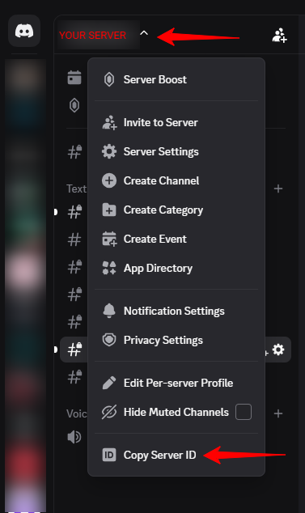

## 2. Create the application

Go to <https://discord.com/developers/applications> and create a new application
called DockSentry, then click the tile to open its settings.

Under **Overview** → **General Information**, copy the **Application ID** into
`DISCORD_APP_ID`.

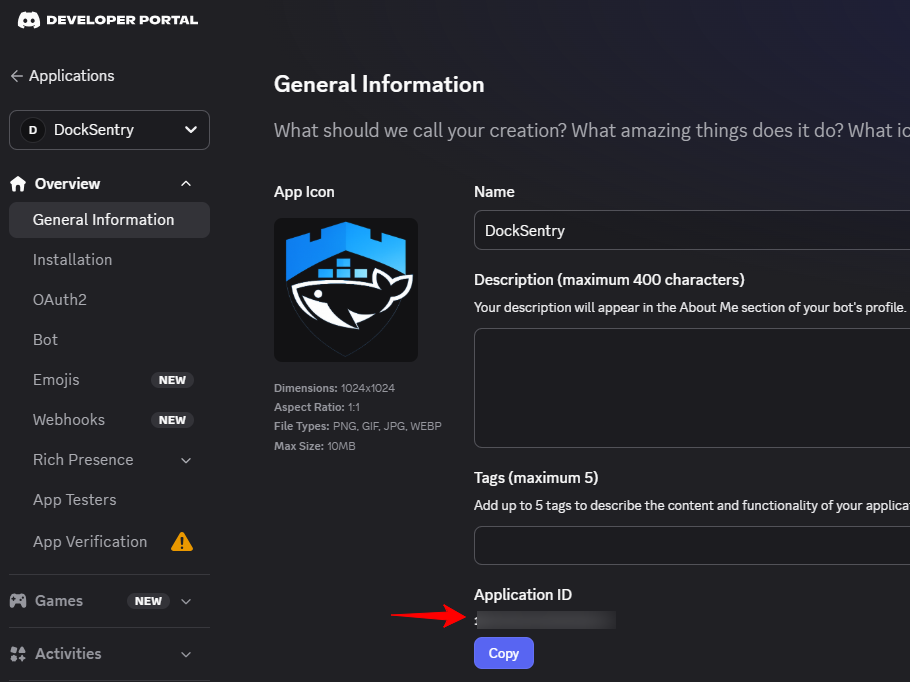

> This is the application's own ID, not your server's. The two are different
> numbers and they go in different variables: this one into
> `DISCORD_APP_ID`, the server's into `DISCORD_GUILD_ID`. Mixing them up
> leaves the bot answering nothing at all.

## 3. Set the install link to None

**Installation** → **Install Link** → **None**.

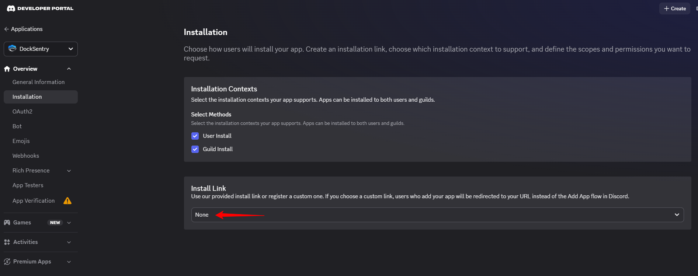

## 4. The bot itself, and its token

**Bot** → set the username to Docksentry. Icon and banner if you fancy it. If a
**Token** is shown, copy it; otherwise press **Reset Token** and copy the new
one. That goes into `DISCORD_BOT_TOKEN`.

Untick **Public Bot** so it stays private and nobody else can invite it.

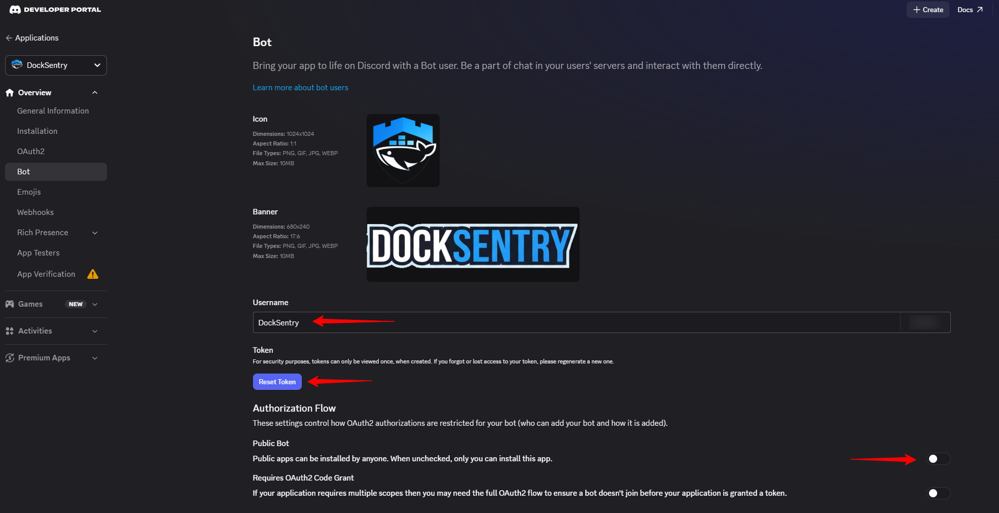

## 5. OAuth2 — build the invite link

**OAuth2**, and set:

- **Redirects** — `http://localhost` as a placeholder.
- **Scopes** — tick **bot**, nothing else.
- **Bot Permissions** — **View Channels** (General), plus **Send Messages** and
  **Use Slash Commands** (Text).
- **Integration Type** — **Guild Install**.

Copy the link out of **Generated URL** and open it in a browser.

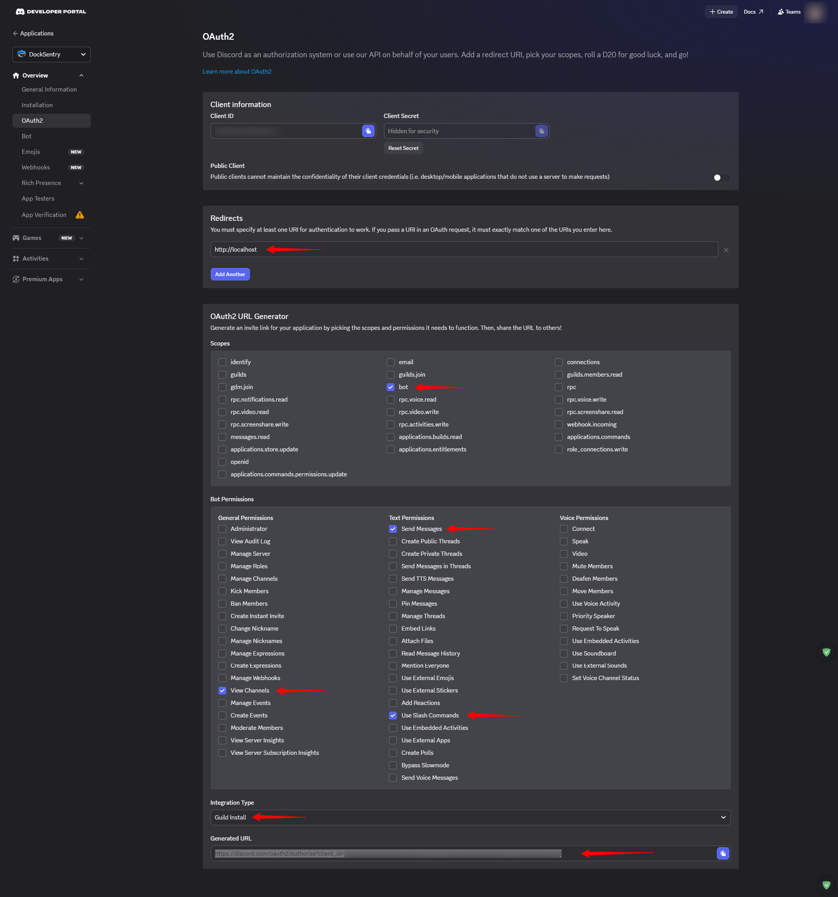

> Those three permissions are what he actually tested, and the bot worked with
> nothing more — it registers slash commands, answers them, and posts into one
> channel, so that is genuinely all it does. Administrator works too and is a
> reasonable enough choice on your own server, but it is far more than this
> needs. `applications.commands` doesn't have to be ticked under Scopes;
> Discord asks for the equivalent anyway on the authorize page, as
> **Use Application Commands** in the next screenshot.

## 6. Authorize it into your server

The generated link opens the authorize page. Pick your server and confirm.

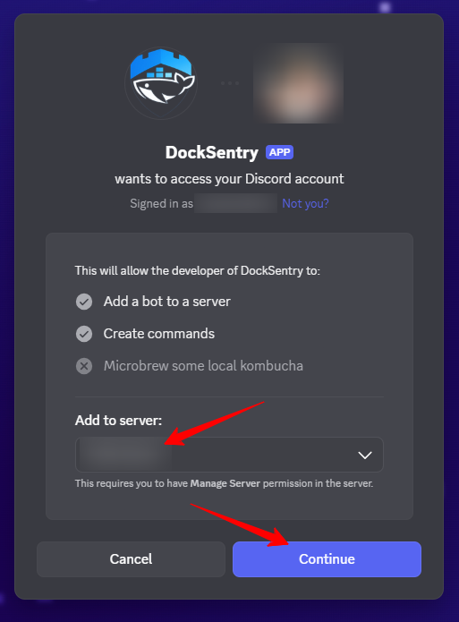

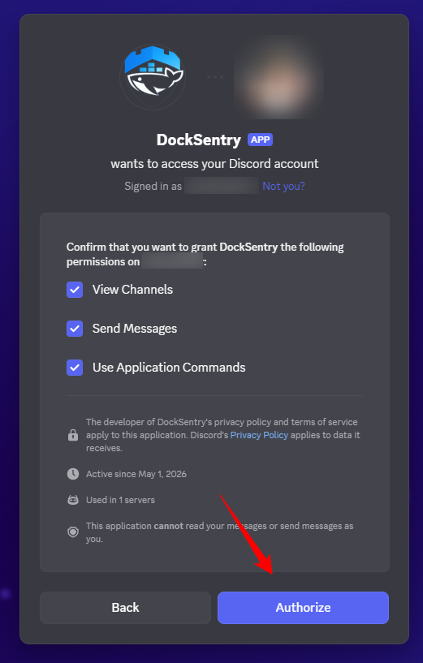

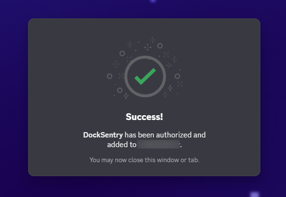

## 7. Let the bot into the channel

Create or pick the channel you want the bot to work in, then open its settings
with the gear icon.

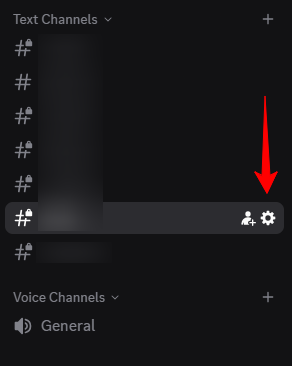

**If the channel is private:** under **Permissions**, click **Add members or
roles**, choose the DockSentry bot listed under **APPS**, and press Done. It
should then show up as a member.

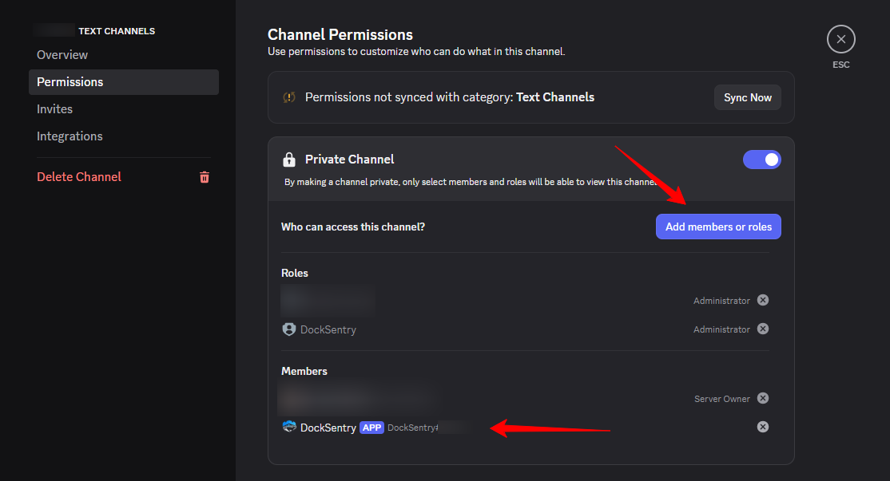

**If the channel is public** (this works for a private one too): click the small
**+** next to ROLES/MEMBERS and add the DockSentry app.

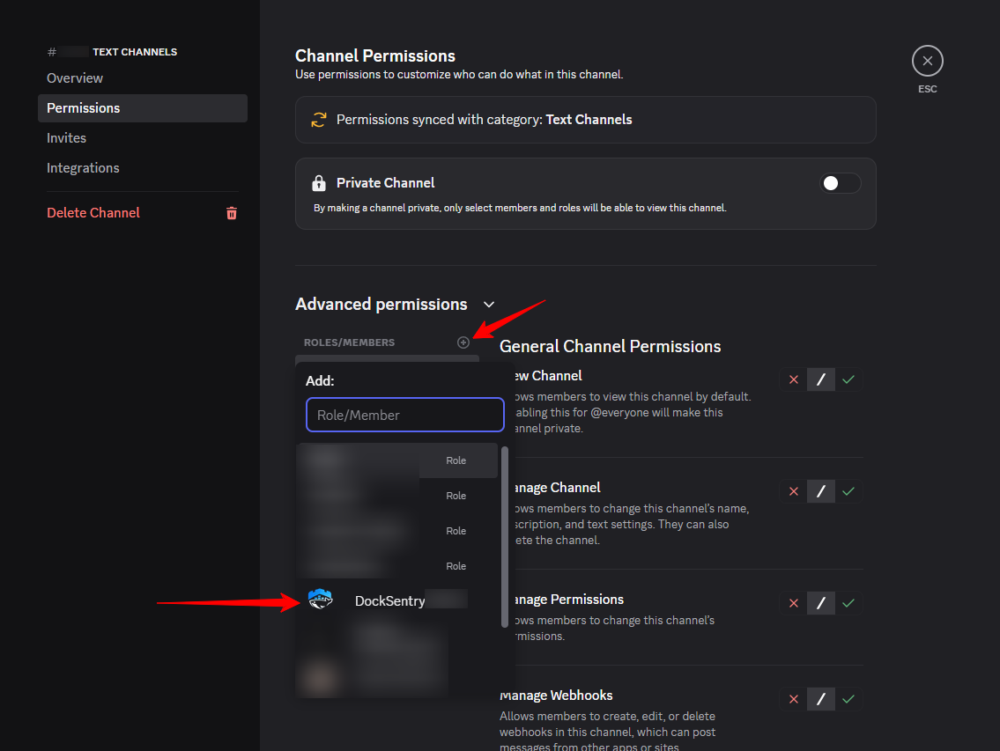

## 8. The channel ID

Back on the main page, right-click the channel you just set up and
**Copy Channel ID**. That goes into `DISCORD_BOT_CHANNEL` — the channel the bot
speaks into on its own account: start-up, alerts, update results. Those are on
by default; `CHANNEL_DISCORDBOT_ENABLED=false` silences them while leaving the
slash commands working.

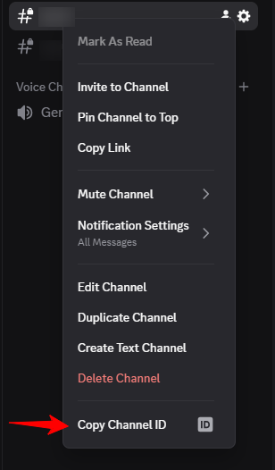

> **Both a Discord webhook and a bot channel pointed at the same channel means
> every notification arrives twice** — the webhook posts it and the bot posts
> it. The Connections page tells you when both are on rather than forbidding it,
> because sending the webhook somewhere else while the bot sits in a private
> channel is a perfectly sensible thing to want.

## 9. Restart and check the log

Restart Docksentry with the variables in place. The log should say this:

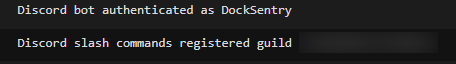

Then go to the channel and run a command. You should get an answer back.

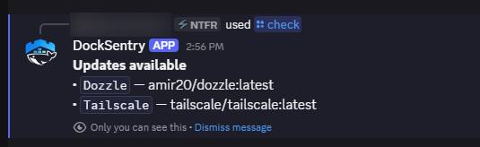

## 10. Lock it down to you — optional, but do it

Click your username at the bottom left, **Copy User ID**, and put that in
`DISCORD_ALLOWED_USERS`. Several people, comma-separated. Leave it empty and
anyone in that server can drive the bot, which is the default.

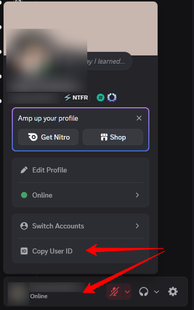

> There is a second layer under this one that costs you nothing: the commands
> are registered Administrator-only and disabled in DMs, so a server admin can
> hand them out per role in Discord itself.

## Replies disappear, and that's on purpose

Slash-command answers are [ephemeral
messages](https://support-apps.discord.com/hc/en-us/articles/26501839512855-Ephemeral-Messages-FAQ):
they show up only on the device that sent the command — not on your other ones,
even for the same account — and they age out of the channel. Worth knowing
before you go looking for a record of what happened.

The reason is that a container listing names your internal services, and a
Discord server can have people in it who shouldn't be reading that. If the
channel is yours, `DISCORD_PUBLIC_REPLIES=true` makes answers ordinary visible
messages that stay put.

That switch is also why the bot channel exists at all — a "Docksentry started"
notice that only appears on one device is no notice at all.

## Commands take options, not words

Discord's commands don't work like Telegram's. `/status docksentry` isn't a
thing; it's `/status container:docksentry`, and for a host, `/status host:local`
— the machine Docksentry itself runs on is called `local`, and `/hosts` lists
the others.

You don't have to remember any of it. Both fields suggest real names while you
type, and the container list follows whichever host you filled in first.

## Setting it up in the Web UI instead

Same values, no compose edit. Every field on the Connections page below is
labelled with the variable it corresponds to:

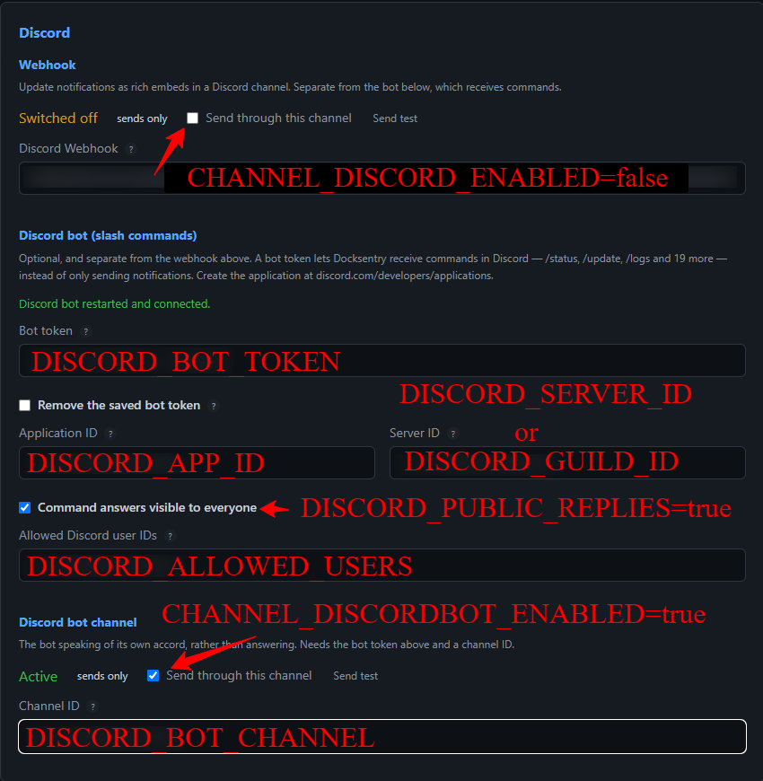

Two switches worth being careful with. **Command answers visible to everyone**
is `DISCORD_PUBLIC_REPLIES` — untick it and answers go back to being private and
self-deleting. **Send through this channel** appears once per channel: under
Discord bot channel it's `CHANNEL_DISCORDBOT_ENABLED`, and under Webhook it's
`CHANNEL_DISCORD_ENABLED`, which is the one to switch off if a webhook and the
bot share a channel and you're getting everything twice.

Full descriptions of all of these live in the
[configuration reference](configuration.md#notifications--discord).
